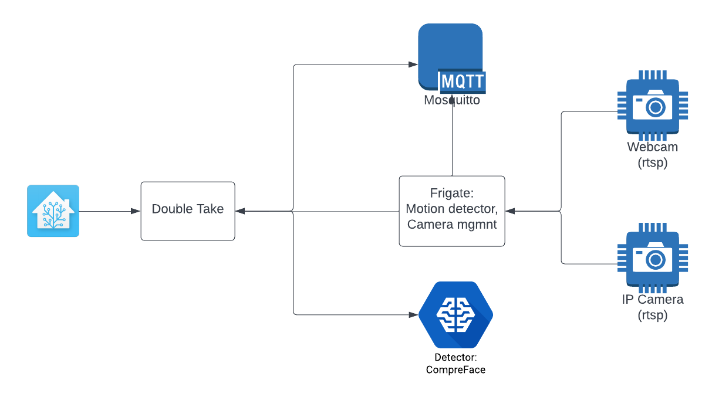

Description
===========



Setup for facial recognition support in Home Assistant. 
We will setup a VM with the following support servers:

1) MQTT Server
2) Frigate 
3) CompreFace / Deepstack
4) Double Take

We will use the camera of laptop or later the camera of raspberry Pi.

Installation from scratch
-------------------------

Username: face Password: support33

See [Installation](./install.md)

Configuring the OVA-file
------------------------

The network adapter must be an "e1000" to see the "enp0s3" adapter in Linux.

When you have downloaded the OVA-file with the installed packages (rtsp-simple-server, Frigate, CompreFace and Double Take ), then you need to perform only the configuration of IP addresses. You need to change the IP addresses to the IP addresses of your guest OS.

To retrieve your unique DHCP IP address:

```
sudo dhcpcd
```

To get the IP address:

```
ip a
```

Normally it is the second IP address of the enp0s3 interface.

Search for "enp0s3" to get its IP address.


Now you can ssh into the guest OS from a terminal:

```
ssh face@<IP address>
```

Password: support33

retrieve the IP address of your guest:

```
ip a
```

goto directory ./rtsp-simple-server and change the **ip-adressen** in the start.sh file of the guest. When changed, run:

```
sudo ./startup.sh
```

Ssh into the guest from a second terminal and configure frigate, change the IP addresses:

```
sudo vi /etc/frigate/frigate.yml
```

Change all the IP addresses and start frigate:

```
cd frigate
sudo docker compose up
```

Frigate is now accessible through URL http://<IP>:5000

Ssh into the guest from a third terminal to start Deepstack:

```
cd deepstack
sudo docker compose up
```

Ssh into the guest from a fourth terminal to start DoubleTake:

```
cd double-take
sudo docker compose up
```

You can now go to Double Take: http://<host ip address>:3000/config to configure it:

```
mqtt:
  host: 192.168.50.178

frigate:
  url: http://192.168.50.178:5000

detectors:
  deepstack:
    url: http://192.168.50.178:8000
    timeout: 15
    opencv_face_required: false
```

Don't forget to change the IP addresses to your Guest IP.

Next time you'll need only to start the rtsp-simple-server, because all other processes will be automatically started by docker.


Challenges
----------

- Try the whole process on a Raspberry Pi (need a Pi with minimal 4G memory). 
- Replace CompreFace with DeepStack 
- Instead of Facial recognition, try number plate recognition.

Notes
-----

- https://www.gyan.dev/ffmpeg/builds/
- https://gist.github.com/edjdavid/513cbee3f9a10cd06e9e49e8bdfa0f96

```
./ffmpeg -f dshow -rtbufsize 1024M -framerate 30 -video_size 640x480 -vcodec mjpeg -i video="Integrated Camera" -f rtsp -rtsp_transport tcp rtsp://192.168.80.128:8554/stream
./ffmpeg -f dshow -rtbufsize 1024M -framerate 30 -video_size 640x480 -vcodec mjpeg -i video="UC CAM75FS-1" -f rtsp -rtsp_transport tcp rtsp://192.168.80.128:8554/stream
```

Add your ESP32-CAM to your frigate configuration:

```
mqtt:
  host: 192.168.1.41
  port: 1883
cameras:
  front:
    ffmpeg:
      inputs:
        - path: http://192.168.1.11:81/stream
          roles:
            - detect
            - record
      input_args: -avoid_negative_ts make_zero -fflags nobuffer -flags low_delay -strict experimental -fflags +genpts+discardcorrupt -use_wallclock_as_timestamps 1 -c:v mjpeg
      output_args:
        record: -f segment -segment_time 10 -segment_format mp4 -reset_timestamps 1 -strftime 1 -c:v libx264 -an
        rtmp: -c:v libx264 -an -f flv
    rtmp:
      enabled: false
    detect:
      width: 640
      height: 480
      fps: 20
  back:
    ffmpeg:
      inputs:
        - path: rtsp://192.168.1.41:8554/stream
          roles:
            - detect
            - rtmp
      hwaccel_args: ''
    detect:
      width: 1280
      height: 720
```

The *front* configuration is the ESP32-CAM. In the **path** variable, you need to replace the IP address of your ESP32-CAM

The *back* configuration is your web-camera (or USB camera).


